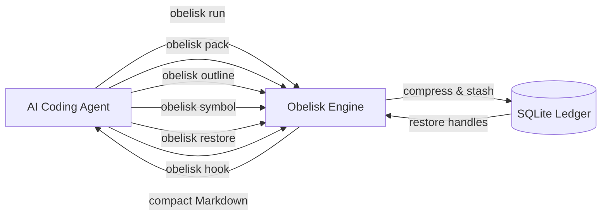

<p align="center">
  <picture>
    <source media="(prefers-color-scheme: dark)" srcset="https://img.shields.io/badge/obelisk-v1.0.0-4A90D9?style=for-the-badge&logo=rust&logoColor=white">
    
  </picture>
</p>

<p align="center">
  <a href="#"></a>
  <a href="#"></a>
  <a href="#"></a>
  <a href="./docs/README.md"></a>
</p>

<h1 align="center">Obelisk</h1>
<p align="center"><strong>Token-optimizing engine for AI coding agents — minimize tokens, lose no context.</strong></p>

<p align="center">
  <code>obelisk run git status</code> · <code>obelisk pack --budget 12000</code> · <code>obelisk outline src/main.rs</code><br>
  <code>obelisk symbol src/main.rs run</code> · <code>obelisk stats</code> · <code>obelisk install claude</code>
</p>

---

## Overview

Obelisk is a single Rust binary that sits between an AI coding agent and everything that bloats its context window. It compresses command output, retrieves code at the symbol level instead of whole files, builds provider-neutral context packs on a token budget, and saves everything to a reversible local SQLite ledger.

**Supported agents:** Claude Code · Codex · OpenCode · Hermes Agent · OpenClaw · Cline

---

## Architecture



---

## Table of Contents

- [What Obelisk Does](#what-obelisk-does)
- [Quick Start](#quick-start)
- [Basic Usage](#basic-usage)
- [Reversible Compression](#reversible-compression)
- [Model-Agnostic Context Packing](#model-agnostic-context-packing)
- [Agent Setup](#agent-setup)
- [Plugins](#plugins)
  - [Claude Code Plugin](#claude-code-plugin)
  - [Hermes Plugin](#hermes-plugin)
  - [Paperclip Plugin](#paperclip-plugin)
- [Self-Improvement Loop](#self-improvement-loop)
- [Troubleshooting](#troubleshooting)
- [Documentation](#documentation)
- [Development](#development)
- [Design Principles](#design-principles)
- [License](#license)

---

## What Obelisk Does

| Layer               | Command                           | What it does                                                   |
|---------------------|-----------------------------------|----------------------------------------------------------------|
| Command output      | `obelisk run <cmd>`               | Compact, reversible view of stdout/stderr                      |
| Boilerplate removal | `obelisk squeeze`                 | Strips ANSI, progress bars, duplicate lines, and opaque blobs  |
| Code retrieval      | `obelisk outline` / `obelisk symbol` | Fetch structure or one symbol instead of whole files        |
| Input packing       | `obelisk pack`                    | Provider-neutral, token-budgeted context bundle                |
| Prose compression   | `obelisk terse`                   | Removes filler from prose while preserving code blocks         |
| Session management  | `obelisk marker` / `obelisk checkpoint` / `obelisk restore` | Compact save/resume for work state |
| API proxy           | `obelisk serve`                   | Local model API proxy with token accounting                    |
| Savings dashboard   | `obelisk stats`                   | Token savings across all layers                                |
| Agent installation  | `obelisk install <agent>`         | Wire Obelisk into supported coding agents                      |
| Self-improvement    | `obelisk learn`                   | Usage-triggered improvement loop (opt-in)                      |

**Key design rule:** Obelisk stays model-agnostic by default. It does not need separate `pack` commands for Claude, GPT, Bedrock, OpenRouter, or local models — one binary, one interface.

---

## Quick Start

```bash
# Clone and build
git clone https://github.com/dylmarriner/obelisk.git
cd obelisk
cargo fmt
cargo test
cargo build --release

# Install the binary
mkdir -p ~/.local/bin
install -m755 target/release/obelisk ~/.local/bin/obelisk

# Add to PATH (add to ~/.bashrc or ~/.zshrc for persistence)
export PATH="$HOME/.local/bin:$PATH"

# Verify
obelisk doctor
```

> **Full setup guide:** [docs/SETUP.md](docs/SETUP.md) — includes PATH persistence, agent hooks, smoke tests, and Token Optimizer setup.

---

## Basic Usage

```bash
# Compress command output (reversible)
obelisk run git status
obelisk run cargo build

# Remove boilerplate from any text
echo "$LONG_LOG" | obelisk squeeze
cat build.log | obelisk squeeze

# Retrieve code at the symbol level
obelisk outline src/main.rs
obelisk symbol src/main.rs run

# Build a token-budgeted context pack
obelisk pack --budget 12000 --diff --dir src --file README.md
obelisk pack --budget 8000 --system AGENTS.md --history session.json --tools tools.json --out .obelisk/context.md

# Save and restore session state
cat session.md | obelisk checkpoint session
obelisk restore 7f3a1b2c4d5e

# Check savings
obelisk stats

# Manage resume points
echo "Current plan and decisions..." | obelisk marker save plan
obelisk marker get plan
obelisk marker list
```

> **Full command reference:** [docs/COMMANDS.md](docs/COMMANDS.md)

---

## Model-Agnostic Context Packing

`obelisk pack` accepts a token budget and context sources, then emits compact Markdown any agent or provider can consume — no per-model templates, no provider-specific formats.

```bash
obelisk pack \
  --budget 12000 \
  --system AGENTS.md \
  --history .agent/session.json \
  --diff \
  --dir src \
  --file Cargo.toml \
  --tools tools.json \
  --out .obelisk/context.md
```

**What it packs:**
- Stable instruction files via `--system`
- Compacted chat/session state via `--history`
- Current git stat/name-only/patch via `--diff`
- Explicit files via `--file`
- Directory maps via `--dir` (no whole-directory dumps)
- Tool schema names/descriptions via `--tools`
- Restore handles for omitted or truncated content

---

## Reversible Compression

Whenever Obelisk compresses something worth restoring, it writes the full original to the local SQLite ledger and leaves an inline restore pointer:

```
[obelisk:restore 7f3a1b2c4d5e — raw via `obelisk restore 7f3a1b2c4d5e`]
```

Restore the original with:

```bash
obelisk restore 7f3a1b2c4d5e
```

---

## Agent Setup

Install only the agents you actually use:

```bash
obelisk install claude
obelisk install codex
obelisk install opencode
obelisk install hermes
obelisk install openclaw
obelisk install cline
```

Then restart the agent. Details for each integration: [docs/AGENT_INTEGRATIONS.md](docs/AGENT_INTEGRATIONS.md)

---

## Plugins

### Claude Code Plugin

A reusable Claude Code plugin with hooks, skills, and a context optimizer agent.

```bash
# Test locally from the repository root
claude --plugin-dir ./plugins/claude-code-obelisk
```

**Includes:**
- `PreToolUse` Bash hook calling `obelisk hook claude`
- `/obelisk:pack-context` for token-budgeted context bundles
- `/obelisk:inspect-symbol` for outline/symbol retrieval
- `/obelisk:compact-output` for noisy command output
- `/obelisk:restore-context` for restore handles
- `context-optimizer` agent for planning compact context before large coding work

**Plugin docs:** [plugins/claude-code-obelisk/README.md](plugins/claude-code-obelisk/README.md)

---

### Hermes Plugin

Combines Obelisk's command-output compression with Token Optimizer's per-turn token tracking, context-fill nudges, and session rollup.

```bash
# Install from repository root
mkdir -p ~/.hermes/plugins
cp -R plugins/hermes-obelisk ~/.hermes/plugins/obelisk
hermes plugins enable obelisk
```

**Obelisk tools:**
| Tool | Description |
|------|-------------|
| `obelisk_run` | Safe read-heavy commands through compact output |
| `obelisk_pack` | Token-budgeted context packs |
| `obelisk_outline` | Source file symbols without full reads |
| `obelisk_symbol` | One symbol from source |
| `obelisk_restore` | Restore compressed blob by handle |
| `obelisk_rewrite` | Command rewrite eligibility check |
| `obelisk_stats` | Token savings across layers |
| `obelisk_doctor` | Installation verification |

**Token Optimizer integration:**
- **Context nudge** — warns at ~70%+ context fill, once per session
- **Per-turn tally** — accumulates input/output/cache/reasoning tokens per session
- **Session rollup** — writes to Token Optimizer `trends.db` for dashboard visibility

**Slash commands:** `/obelisk`, `/obelisk-stats`, `/obelisk-doctor`, `/obelisk-token`
**CLI commands:** `hermes obelisk-doctor`, `hermes obelisk-stats`, `hermes obelisk-token`
**Bundled skills:** `obelisk:pack-context`, `obelisk:inspect-symbol`, `obelisk:compact-output`, `obelisk:restore-context`

**Requirements:**
- `obelisk` binary on PATH (`~/.local/bin/obelisk`)
- Token Optimizer repo at `~/Documents/token-optimizer/` (for dashboard/rollup)

**Plugin docs:** [plugins/hermes-obelisk/README.md](plugins/hermes-obelisk/README.md)

---

### Paperclip Plugin

Early prototype targeting Paperclip's repeated task-start and heartbeat context.

```bash
cd plugins/paperclip-obelisk
npm install
npm run check
npm run build
```

**Tools:** `task-pack` · `heartbeat-pack` · `compress-run-output` · `restore-context` · `context-diff` · `savings-report`

**Goal:** Replace full-context heartbeat resends with compact task capsules, change deltas, workspace diffs, and restore handles.

**Plugin docs:** [plugins/paperclip-obelisk/README.md](plugins/paperclip-obelisk/README.md)

---

## Self-Improvement Loop

Obelisk includes an optional usage-triggered self-improvement loop:

```bash
obelisk learn status
obelisk learn gaps
obelisk learn enable /path/to/obelisk --threshold 15
obelisk learn disable
```

> ⚠️ **Warning:** The current checked-in behavior can commit and push to `main` after passing build/test gates. Read [docs/SELF_IMPROVEMENT.md](docs/SELF_IMPROVEMENT.md) before enabling.

---

## Troubleshooting

Quick diagnostic:

```bash
which obelisk
obelisk doctor
obelisk rewrite git status
obelisk stats
grep -Rni "obelisk" ~/.claude ~/.config/opencode ~/.codex ~/.hermes .clinerules 2>/dev/null || true
```

**Full troubleshooting guide:** [docs/TROUBLESHOOTING.md](docs/TROUBLESHOOTING.md)

---

## Documentation

| Resource | Description |
|----------|-------------|
| [Documentation Index](docs/README.md) | Overview of all docs |
| [Setup Guide](docs/SETUP.md) | Install, build, PATH, agent hooks, Token Optimizer |
| [Command Reference](docs/COMMANDS.md) | Every command with examples and flags |
| [Agent Integrations](docs/AGENT_INTEGRATIONS.md) | Claude Code, Codex, Hermes, OpenCode, OpenClaw, Cline |
| [Self-Improvement](docs/SELF_IMPROVEMENT.md) | Learning loop risks and operation |
| [Troubleshooting](docs/TROUBLESHOOTING.md) | Common failures and fixes |
| [Claude Code Plugin](plugins/claude-code-obelisk/README.md) | Plugin README |
| [Hermes Plugin](plugins/hermes-obelisk/README.md) | Plugin README (includes Token Optimizer) |
| [Paperclip Plugin](plugins/paperclip-obelisk/README.md) | Plugin README |

---

## Development

```bash
cargo fmt
cargo test
cargo build --release
```

---

## Design Principles

- **One binary, zero background services** — unless you explicitly run `obelisk serve`
- **Dependency-light** — Rust implementation with minimal crate footprint
- **Local-first** — all storage is in a local SQLite ledger
- **Model-agnostic** — the same `pack` command works across all providers
- **Reversible compression** — every compressed output has a restore handle
- **Agent hooks** — thin, read-only command interception
- **Plugin architecture** — Claude Code, Hermes, and Paperclip plugins as adapters, not engine rewrites

---

## License

MIT — see [LICENSE](./LICENSE) for details.
