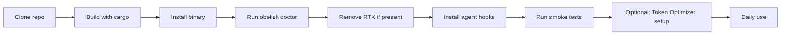

  
  

# Documentation

<strong>Everything you need to build, install, configure, and operate Obelisk.</strong>

---

## Quick Navigation

| If you want to...                                         | Start here                        |
|-----------------------------------------------------------|-----------------------------------|
| Build from source and install the binary                  | [Setup Guide](SETUP.md)           |
| Wire Obelisk into your coding agent                       | [Agent Integrations](AGENT_INTEGRATIONS.md) |
| Learn every command and flag                              | [Command Reference](COMMANDS.md)  |
| Fix something that is not working                         | [Troubleshooting](TROUBLESHOOTING.md) |
| Understand the self-improvement loop                      | [Self-Improvement](SELF_IMPROVEMENT.md) |
| Install the Claude Code plugin package                    | [Claude Code Plugin](../plugins/claude-code-obelisk/README.md) |
| Set up the Hermes plugin with Token Optimizer integration | [Hermes Plugin](../plugins/hermes-obelisk/README.md) |
| Understand the Paperclip plugin prototype                 | [Paperclip Plugin](../plugins/paperclip-obelisk/README.md) |

---

## Recommended Setup Path

1. **Build and install** Obelisk from source — [Setup Guide](SETUP.md#clone-and-build)
2. **Verify** with `obelisk doctor` — [Setup Guide](SETUP.md#install-the-binary)
3. **Remove RTK** if you used it before — [Setup Guide](SETUP.md#remove-rtk-first-if-you-used-it)
4. **Install agent hooks** for the agents you use — [Agent Integrations](AGENT_INTEGRATIONS.md)
5. **Run smoke tests** — [Setup Guide](SETUP.md#smoke-tests)
6. **Set up Token Optimizer** (Hermes plugin only) — [Setup Guide](SETUP.md#token-optimizer-setup-hermes-plugin)
7. **Leave self-improvement disabled** until you understand it — [Self-Improvement](SELF_IMPROVEMENT.md)

---

## Document Index

### Core Documentation

| Document | Contents |
|----------|----------|
| [Setup Guide](SETUP.md) | Requirements, building, installation, PATH setup, RTK migration, agent hooks installation, smoke tests, Token Optimizer setup, daily workflow, updating |
| [Command Reference](COMMANDS.md) | All CLI commands: `run`, `squeeze`, `terse`, `outline`, `symbol`, `pack`, `marker`, `checkpoint`, `restore`, `serve`, `stats`, `gc`, `install`, `hook`, `rewrite`, `doctor`, `learn` |
| [Agent Integrations](AGENT_INTEGRATIONS.md) | Claude Code, Codex, OpenCode, Hermes (with Token Optimizer), Paperclip, OpenClaw, Cline — install, verify, troubleshoot |
| [Self-Improvement](SELF_IMPROVEMENT.md) | Learning loop architecture, gaps, risks, recommended safeguards, v2 design |
| [Troubleshooting](TROUBLESHOOTING.md) | Binary not found, ledger failures, RTK conflicts, hook issues, pack too small/large, build failures, self-improvement, Token Optimizer bridge issues |

### Plugin Documentation

| Document | Contents |
|----------|----------|
| [Claude Code Plugin](../plugins/claude-code-obelisk/README.md) | Plugin structure, hooks, skills, context optimizer agent |
| [Hermes Plugin](../plugins/hermes-obelisk/README.md) | Obelisk tools, Token Optimizer hooks, slash commands, CLI commands, skills |
| [Paperclip Plugin](../plugins/paperclip-obelisk/README.md) | Prototype architecture, tools, build steps, integration direction |

---

## Design Rules

- **Model-agnostic by default.** Provider-specific token counters can wrap Obelisk output, but they do not infect the core CLI.
- **Compression preserves recovery.** Restore handles let you recover any original content.
- **Agents prefer outlines and symbols** over whole-file reads.
- **Autonomous self-improvement is review-first,** not surprise-push-to-main chaos.
- **Plugins are adapters.** Obelisk remains the engine.

---

<a href="../README.md">← Back to README</a>

