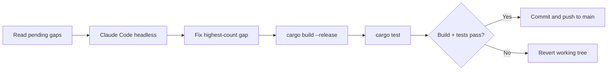

<p align="center">
  <a href="./README.md"></a>
  <a href="../README.md"></a>
</p>

# Self-Improvement

**Obelisk has an optional usage-triggered self-improvement loop.** It watches real usage gaps, asks an agent to make one minimal fix, gates the result on Rust build/tests, and can commit the result.

> ⚠️ **Read this before enabling.** The current checked-in script can push directly to `main` after passing gates. Passing tests proves nothing about correctness, security, or architectural soundness — it only proves the tests noticed nothing.

---

## Table of Contents

- [Status](#status)
- [What Is a Gap?](#what-is-a-gap)
- [Current Implementation Flow](#current-implementation-flow)
- [Known Issues](#known-issues)
- [Safer Target Behavior](#safer-target-behavior)
- [Recommended Safeguards](#recommended-safeguards)
- [How to Inspect Gaps](#how-to-inspect-gaps)
- [Good vs Bad Candidates](#good-vs-bad-candidates)
- [Disable Immediately](#disable-immediately)
- [Future Improvements](#future-improvements)

---

## Status

Self-improvement is **disabled by default**.

```bash
# Check status
obelisk learn status

# Enable (read this doc first!)
obelisk learn enable /path/to/obelisk --threshold 15

# Disable
obelisk learn disable

# Show pending gaps
obelisk learn gaps
```

---

## What Is a Gap?

A gap is a signal that Obelisk lacks coverage or correctness in some area. Current gap types:

| Gap Type | Meaning |
|----------|---------|
| `no_filter` | A command was routed through Obelisk but has no dedicated filter |
| `restore_miss` | A restore handle could not be found |

**Example gap path:**

```
obelisk run some-tool
↓
no dedicated filter exists
↓
Obelisk records `no_filter` for `some-tool`
↓
if enough gaps pile up, self-improvement may trigger
```

---

## Current Implementation Flow

The current script is `scripts/self-improve.sh`.



1. Refuses to run on a dirty working tree
2. Fetches `origin/main`
3. Fast-forwards local `main` only if possible
4. Reads pending gaps with `obelisk learn gaps`
5. Calls Claude Code headless with a prompt to fix exactly one highest-count gap
6. Runs `cargo build --release`
7. Runs `cargo test`
8. If build/tests pass, commits and pushes to `main`
9. If build/tests fail, reverts the working tree

---

## Known Issues

### Sequencing problem

The Rust side can mark gaps as triggered before the shell script reads them. If that happens, the script sees no pending gaps and does nothing.

**Recommended v2 fix:**
1. Generate a frozen gap snapshot first
2. Pass that snapshot file to the script
3. Mark gaps as triggered only after the snapshot exists
4. Have the script read the snapshot, not the live pending queue
5. Push a review branch instead of `main`
6. Open a PR when `gh` is available

---

## Safer Target Behavior

The safer loop should look like:


That is still autonomous, but it leaves an audit trail and a review step.

---

## Recommended Safeguards

Before enabling:

```bash
cd /path/to/obelisk
git status
cargo test
cargo build --release
```

Make sure local `main` tracks origin cleanly:

```bash
git checkout main
git fetch origin main
git merge --ff-only origin/main
```

Keep logs visible:

```bash
tail -f .self-improve.log
```

Use a high threshold at first:

```bash
obelisk learn enable /path/to/obelisk --threshold 50
```

Lower it later only after reviewing several runs.

---

## How to Inspect Gaps

```bash
obelisk learn status
obelisk learn gaps
```

The current compact gaps view groups by kind, program, and count. A v2 design should include representative samples so the repair agent can write filters from real output instead of just a count.

---

## Good vs Bad Candidates

### Good candidates for self-improvement

- Missing command filters
- Overly noisy output for known tools
- Restore miss bugs
- Parser edge cases with tests
- Small compression correctness issues

### Bad candidates (do not auto-fix)

- Major architecture refactors
- Dependency rewrites
- Provider-specific model logic
- Secret handling
- Deployment automation
- Anything requiring product judgement

---

## Disable Immediately

```bash
obelisk learn disable
```

If a run is active, remove the lock only after confirming no `self-improve.sh` process is running:

```bash
ps aux | grep self-improve.sh | grep -v grep
rm -f ~/.local/share/obelisk/self-improve.lock
```

> The exact data directory can vary by platform.

---

## Future Improvements

| Priority | Improvement |
|----------|-------------|
| High | Frozen gap snapshots |
| High | Representative gap samples |
| High | Branch/PR workflow instead of `main` pushes |
| Medium | Dry-run mode |
| Medium | Allowlist of editable files |
| Medium | Maximum diff size enforcement |
| Low | GitHub Actions validation before review |
| Low | Automatic issue creation for repeated failures |
| Low | Better gap taxonomy: `bad_filter`, `overcompressed`, `undercompressed`, `parse_miss`, `restore_miss`, `agent_hook_error` |

---

<p align="center"><a href="./README.md">← Documentation Index</a> · <a href="../README.md">Back to README</a></p>
