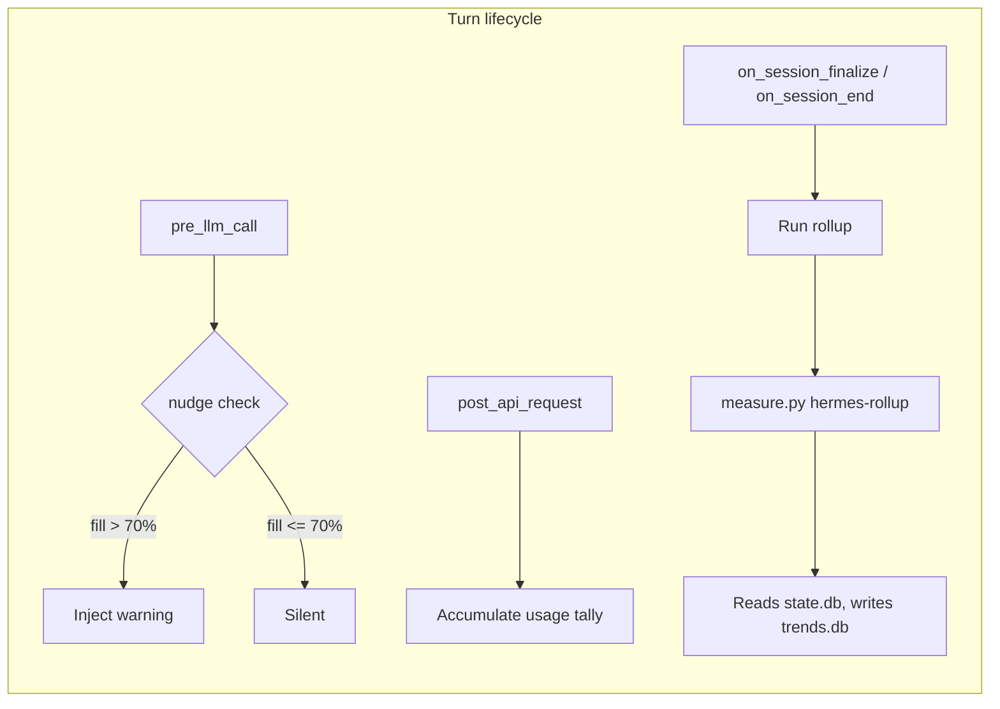

<p align="center">
  <a href="../../README.md"></a>
  <a href="../../docs/README.md"></a>
</p>

# Obelisk Hermes Plugin

**Unified token optimization for Hermes Agent.** Merges Obelisk's command-output compression tools with Token Optimizer's per-turn token tracking, context-fill nudges, and session rollup.

---

## Table of Contents

- [What It Does](#what-it-does)
- [Requirements](#requirements)
- [Installation](#installation)
- [Obelisk Tools](#obelisk-tools)
- [Token Optimizer Hooks](#token-optimizer-hooks)
- [Slash Commands](#slash-commands)
- [CLI Commands](#cli-commands)
- [Bundled Skills](#bundled-skills)
- [Context Nudge Details](#context-nudge-details)
- [How It Works](#how-it-works)
- [Privacy](#privacy)

---

## What It Does

### Obelisk (command compression)

| Component | Description |
|-----------|-------------|
| `obelisk_run` | Run safe read-heavy commands through compact, reversible output |
| `obelisk_pack` | Build token-budgeted context packs from files, diffs, history |
| `obelisk_outline` | List source file symbols without reading the full file |
| `obelisk_symbol` | Extract one named symbol from a source file |
| `obelisk_restore` | Restore a compressed blob/checkpoint by handle |
| `obelisk_rewrite` | Ask Obelisk whether a command should be wrapped |
| `obelisk_stats` | Show token savings across Obelisk layers |
| `obelisk_doctor` | Verify Obelisk installation |

### Token Optimizer (usage tracking)

| Feature | Description |
|---------|-------------|
| **Context nudge** | Proactively warns when context fill crosses ~70%, once per session |
| **Per-turn tally** | Accumulates input/output/cache/reasoning tokens per session |
| **Session rollup** | Writes session data into the shared Token Optimizer `trends.db` for dashboard visibility |
| **`/obelisk-token`** | Slash command showing token and cost summary for recent sessions |
| **`hermes obelisk-token`** | CLI subcommand to open the Token Optimizer dashboard |

---

## Requirements

| Dependency | Location | Purpose |
|-----------|----------|---------|
| **Obelisk binary** | `~/.local/bin/obelisk` (on PATH) | Core engine |
| **Token Optimizer repo** | `~/Documents/token-optimizer/` | `measure.py` engine for rollup and dashboard |

---

## Installation

### 1. Build and install Obelisk

```bash
cargo build --release
mkdir -p ~/.local/bin
install -m755 target/release/obelisk ~/.local/bin/obelisk
export PATH="$HOME/.local/bin:$PATH"
obelisk doctor
```

### 2. (Optional) Clone Token Optimizer for dashboard/rollup

```bash
git clone https://github.com/alexgreensh/token-optimizer.git ~/Documents/token-optimizer
```

### 3. Install the plugin

```bash
mkdir -p ~/.hermes/plugins
cp -R plugins/hermes-obelisk ~/.hermes/plugins/obelisk
hermes plugins enable obelisk
```

The plugin is already installed at `~/.hermes/plugins/obelisk/` and enabled when you use the `obelisk install hermes` command.

---

## Tool Schemas

| Tool | Parameters | Description |
|------|-----------|-------------|
| `obelisk_run` | `command` (required), `timeout_seconds`, `cwd` | Safe command via Obelisk |
| `obelisk_pack` | `budget`, `system`, `history`, `files`, `dirs`, `diff`, `tools`, `out`, `cwd` | Token-budgeted context pack |
| `obelisk_outline` | `file` (required), `cwd` | Source file symbols |
| `obelisk_symbol` | `file` (required), `name` (required), `cwd` | One symbol from source |
| `obelisk_restore` | `handle` (required), `cwd` | Restore compressed blob |
| `obelisk_rewrite` | `command` (required), `cwd` | Command rewrite check |
| `obelisk_stats` | `cwd` | Token savings stats |
| `obelisk_doctor` | `cwd` | Installation check |

---

## Context Nudge

Before each turn, the `pre_llm_call` hook estimates how full the context window is. If >70%, it appends a one-line warning to the user message:

```
[Obelisk] Context ~73% full (~146,000 input tokens vs assumed 200,000 window)
Grade: C. Avoid adding large files; prefer targeted reads.
```

At 85%+, the tip suggests `/compact`.

---

## How It Works



### Privacy

- `hermes_state.py` opens `~/.hermes/state.db` read-only with `PRAGMA query_only = ON`
- No data sent to any external service. No telemetry. No network calls.

---

<p align="center"><a href="../../README.md">← Back to README</a> · <a href="../../docs/README.md">Documentation Index</a></p>
